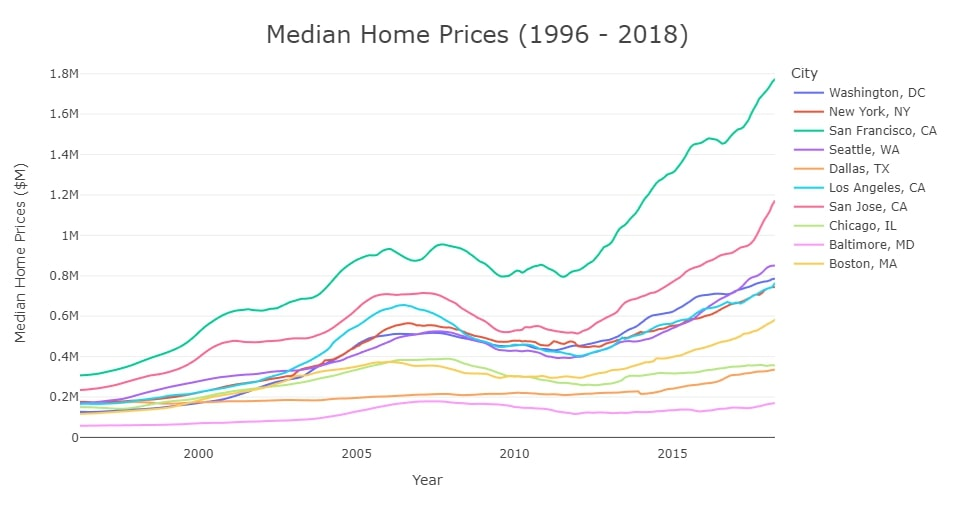
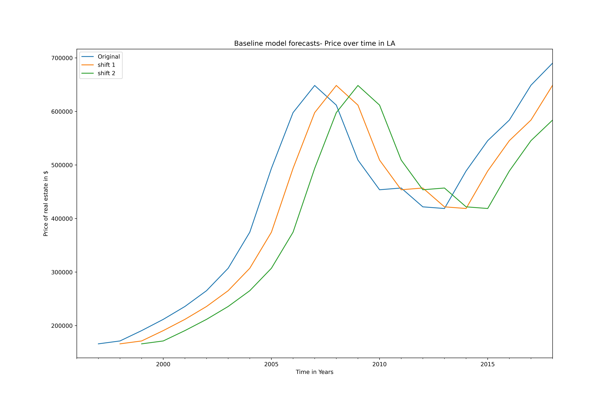
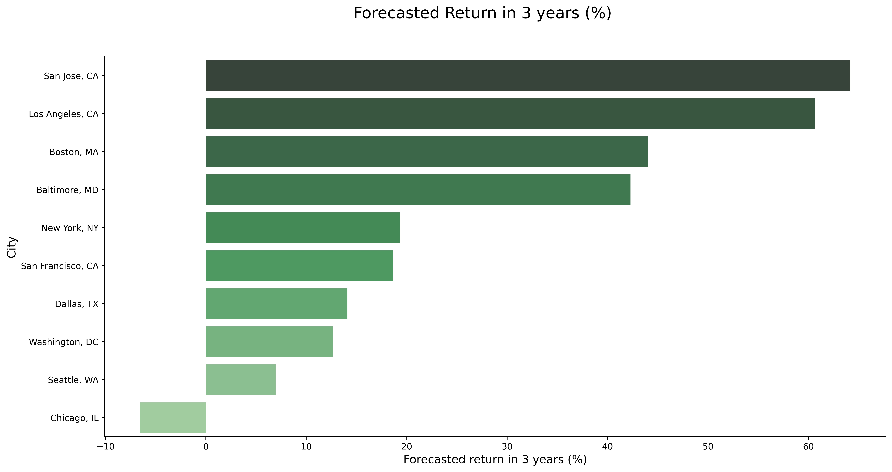
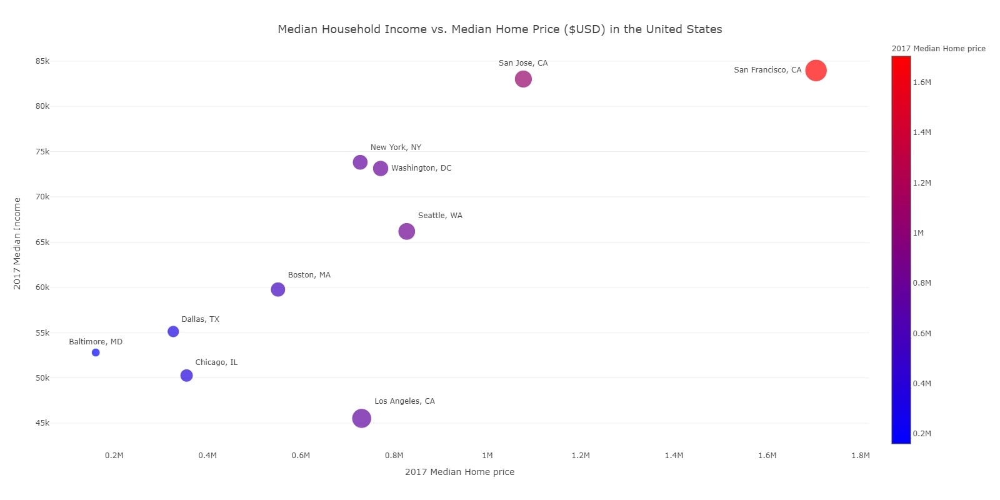

# Top 5 Tech Cities in the U.S to invest in
### Forcasting housing market in major tech cities in the US
May 2022
### Authors

- Alice Agrawal: 
[LinkedIn](https://www.linkedin.com/in/alice-agrawal/) | 
[GitHub](https://github.com/aliceagrawal) | 
[Email](mailto:alice.agrawal30@gmail.com)

- Hanis Zulmuthi: 
[LinkedIn](https://www.linkedin.com/in/hanis-zulmuthi/) | 
[GitHub](https://github.com/hanis-z) | 
[Email](mailto:haniszulaikha96@gmail.com)

- Jordan Kominsky: 
[LinkedIn](https://www.linkedin.com/in/jordan-kominsky/) | 
[GitHub](https://github.com/jskominsky) | 
[Email](mailto:jskominsky@gmail.com)

- Kyongmin So: 
[LinkedIn](https://www.linkedin.com/in/kyongminso/) | 
[GitHub](https://github.com/kyongminso) | 
[Email](mailto:kyongminso@gmail.com)

- Tyler Wood: 
[LinkedIn](https://www.linkedin.com/in/tyler-wood-08a036216/) | 
[GitHub](https://github.com/twood2015) | 
[Email](mailto:T.wood20151996@gmail.com)


## Overview

Real estate has always been one of the most dependable markets when looking for consistent, yet high returns. Even after the housing crash of 2008, it only took a few years for the market to return to previous highs, and it has maintained steady growth ever since. This has been especially true in markets with high incomes and high density such as San Francisco or New York. Tech jobs are also gaining prominence in the job market and acquiring real estate that could serve these migrating employees could give us a competitive edge.

## Business Problem

Tech is becoming a larger part of both the US and the Global economy every year. As tech grows in a city, it doesn't only bring tech jobs, it also brings other facets of culture. In the main tech hubs of America, you'll find much more than just the industrious culture of modern technology; there will be growth in art exhibits, breweries, parks, and many other places where people can share experiences. These traits make tech cities desirable places of residence not only for those in technology, but also anyone who values being in a place that is culturally engaging.

As time goes on, less people are deciding to stay in their small towns and are moving to larger cities instead. We can see a chart from business insider that portrays the shrinking of rural America [here](https://www.businessinsider.com/us-census-map-widespread-population-declines-in-rural-areas-2021-8). Furthermore, when we look at the growth of cities, we find that the largest cities are growing at the fastest rate. This article from the [Brookings Institute](https://www.brookings.edu/blog/the-avenue/2017/10/17/big-cities-small-cities-and-the-gaps/) mentions this phenomenon.

A large proportion of this growth will most likely be seen in these emerging tech hubs due to their wide cultural and employment appeal. We selected 10 cities to analyze in America that we think hold promise as places of high growth. We decided on these 10 due to an [Indeed article](https://www.indeed.com/career-advice/finding-a-job/top-cities-for-tech-jobs-2020) that asserted these cities as places of high prominence in the tech industry. Specifically, these cities were Washington D.C., New York City, Seattle, San Francisco, Los Angeles, San Jose, Dallas, Boston, Chicago, and Baltimore. Many of these places have expensive markets already, but there is no shortage of demand for housing in any of these cities. As the tech sector continues to grow, there will be an even greater need to develop housing. The political landscape is starting to warm up to higher density developments such as multiplexes, which will allow for new housing development opportunities in these markets that have previously been unprofitable. Focusing on these high growth areas will provide us an advantage over the competition that is more cautious to invest in these markets with higher upfront investment barriers.

## Data

### Home Price
Source: [Zillow Dataset](https://www.zillow.com/research/data/)

Contents: We acquired data for 14,723 different zip codes in America. The data provided monthly data on the median home price for every zip code from April 1996 to April 2018. We selected the data from the 10 prominent tech cities specified earlier, and ran a time series analysis on all of them.

### 2017 Median Income
Source: [Kaggle Dataset](https://www.kaggle.com/datasets/goldenoakresearch/us-household-income-stats-geo-locations?select=Income_Methodology.pdf)

Contents: We also found data on the median income for our 10 cities. We used this to look at the home price to income ratio for our 10 cities and compare it to the U.S. average of 5.75.


## Methods

We can see from this graph that many of these markets have been increasing exponentially, and all have been consistently rising since recovering from the housing crash in 2008.



### Baseline Model
For the baseline model, we shifted our time-series data for 3 periods. We chose the period of 3 years to allow us to forecast home prices 3 years ahead using our baseline model. Moreover, we used RMSE for our scoring and attained an RMSE score of $118,00 for our baseline model.



### ARIMA Model 
We used an ARIMA model to forecast the average house price in 10 cities. We score the model predictions using root mean squared error. The most critical component of the ARIMA model is the (p,d,q) order of the model for the autoregressive, differences, and moving average components. We found that our best model had the order of 1 for Auto Regression, 2 for differences and 3 for moving average components. 

Our RMSE score for our final model was approximately $33,500 compared to our baseline RMSE which was $118,000.


## Conclusion 

### Recommendations
The forecasts show the largest growth in San Jose, Los Angeles, Boston, Baltimore, and New York. We would suggest focusing on these markets. 
 

 
San Francisco was a close runner-up. While San Francisco will provide a return of 20%, we do not recommend investing there because as you can see in this graph, they have the highest median home price, nearly 1.8 million dollars.  
 
The risk and return trade-off is better in other cities with significantly lower home prices. We would be able to diversify much more in cities like Baltimore or Los Angeles. 
 

 
There is a good balance to the 5 cities we have suggested here that should hedge against itself. San Jose, Boston, and New York are well established cities with not a lot of buildable land left. Just owning real estate in these cities will ensure that values will give consistent returns. However, Baltimore and Los Angeles have more land that could give huge returns if invested in and renovated properly. The trick would be doing this in a manner that does not feel to be undermining the affordability, culture, or diversity of these neighborhoods as is often the case. These rennovations must not feel gaudy, but seemless and at home with the current residents. Another more ethically straightforward, but politically challenging idea is looking into building more dense housing in the suburbs with multiplexes or townhouses. These projects often run into obstacles, but as NIMBY culture becomes less popular and zoning reform progresses, new investment opportunities should arise.

### Information
Check out our [notebook](https://github.com/aliceagrawal/Zillow-Time-Series-Modeling/blob/main/Final_Notebook-Top-5-Cities.ipynb) for a more thorough discussion of our project, as well as our [presentation](https://github.com/aliceagrawal/Zillow-Time-Series-Modeling/blob/main/Zillow-home-price-forecasts.pdf).


### Next Steps

There are several steps that could be taken to give even more value if we had the funding. While our model performed quite well, it was evaluated on test data that was consistently a bull market. If the market was bear or particularly volatile, it is unlikely that the model would perform as well. This is particularly seen with the prediction for Chicago market. Because Chicago was in a short term slump in our most recent data points, this market shrinkage was projected to continue for the next three years. Designing a model that could differentiate volatility changes as opposed to structural market failures could allow for much better predictions.

Furthermore, our model only looked at factors endogenous to the time series data. While this is useful for understanding how real estate markets change over time, it does nothing to explain all the other factors that are driving changes in housing prices. If we had more data on factors relevant to housing prices, such as housing density, quality of infrastructure, and cultural engagement, then we could explain so much more of the variance that our model failed to explain. In particular, we could use more complex models like SARIMAX, or even a Long-short Term Memory Neural Network to catch on to patterns completely unexplored by our current model.

Finally, since this data has been recorded, much has changed in the real estate market. COVID-19 made the real estate market come to an abrupt halt, only for the absurdly low interest rates to trigger one of the greatest housing market shortages in decades. And now, with the interest rates increasing once more, it seems that the housing market is starting to cool off once more. A simple ARIMA model like ours would be completely inadequate to analyzing all the crazy changes seen over the last three years. Having more recent data could give very useful insights on understanding many different phenomena induced by the pandemic.


## Repository Structure
```
 ├── Data
 ├── gitignore
 ├── Individual Notebooks
 │       ├── Alice's Notebook.ipynb
 │       ├── Hanis-Notebook.ipynb
 │       ├── Jordan's Notebook.ipynb
 │       ├── Kyongmin Stuff.ipynb
 │       ├── Tyler's (Real) Notebook.ipynb
 ├── figures
 ├── Final_Notebook-Top-5-Cities.ipynb
 ├── README.md
 └── Presentation.pdf
  
```
